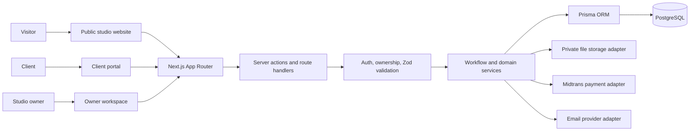
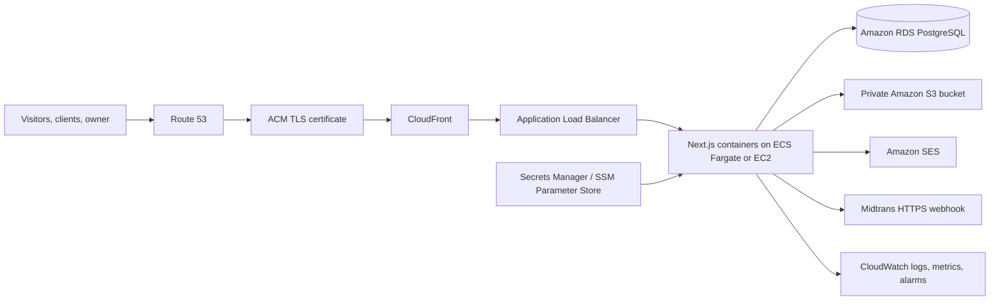

# RRS Studio — Web & Product Studio Operations Platform

> A quotation-first client collaboration platform for an independent web and product studio.

**RRS Studio** combines a premium public-facing studio website with secure operational workflows for inquiries, quotations, agreements, projects, payments, delivery, and verified client reviews.

> [!IMPORTANT]
> **Deployment status:** the application is validated locally and ready for staging preparation. The AWS architecture below is a documented production blueprint for this project and portfolio—not a claim that production AWS resources are currently live.

## Why it exists

A studio project should not begin with an anonymous checkout. RRS uses a structured, consultative workflow that keeps scope, commercial terms, delivery, and client approvals connected in one system.

```text
Project brief
→ WhatsApp consultation
→ Inquiry
→ Versioned quotation
→ Protected agreement
→ Project & milestones
→ Invoice / payment verification
→ Delivery approval
→ Verified review
```

This is **not** a multi-vendor marketplace or a fixed-price e-commerce checkout. Public service prices are starting points; final pricing and scope are defined through an Owner-created quotation.

---

## Product capabilities

### Public studio experience

- Editorial studio website with Indonesian-first localization and persistent English preference.
- Services, portfolio, case studies, verified reviews, contact, and project brief flows.
- Managed Service Types with public catalog filtering.
- WhatsApp continuation from a structured project brief.
- Public quotation links with secure hashed tokens, expiry, view activity, and revision/rejection handling.

### Owner workspace

- Inquiry pipeline, reversible archive, and bulk archive controls.
- Versioned quotation builder with scope, items, commercial totals, payment terms, and public client view.
- Project, milestone, message, file, invoice, and manual payment-proof management.
- Workflow-safe project status transitions; only valid next states are offered in the interface.
- Protected immutable agreement records with acceptance evidence.
- Operational analytics for pipeline, financial health, active clients, workload, and attention items.
- Review moderation for reviews tied to completed projects only.

### Client portal

- Client-owned quotations, agreements, projects, files, invoices, payment proof uploads, and project messages.
- Private agreement review before acceptance; no public agreement links.
- Client delivery approval, followed by a verified review invitation.

---

## Architecture



### Engineering boundaries

```text
App Router page/layout
→ feature query or server action
→ authorization + Zod boundary
→ domain service / transaction
→ Prisma or provider adapter
→ PostgreSQL / external provider
```

Key invariants:

- Financial totals are calculated server-side with decimal arithmetic.
- Sent quotation versions are immutable.
- Quotation acceptance atomically creates the client association, agreement, project, payment schedule, and first invoice.
- Project status transitions are explicitly guarded server-side.
- Agreement content is an immutable snapshot, visible only to its client and Owner.
- Manual payment verification updates payment, invoice, project, notification, and audit data atomically.
- Archived inquiries and quotations remain included in business analytics.

---

## Security and privacy

- Auth.js credentials sessions with distinct `OWNER` and `CLIENT` roles.
- JWT session identity is validated against the current database user before protected workspace access or mutation.
- Server-side ownership checks on projects, agreements, invoices, messages, and private files.
- Protected agreements are never public URLs or token capabilities.
- Public quotation and review tokens are stored as hashes.
- Zod validation at action, route, environment, and webhook boundaries.
- Rate limits for sensitive public actions and uploads.
- Private file storage, upload validation, CSP/security headers, and audit records.
- Midtrans webhooks are designed for signature, amount, reference, and idempotency validation.

See [`docs/security-baseline.md`](docs/security-baseline.md) and [`docs/threat-model.md`](docs/threat-model.md) for the detailed baseline.

---

## AWS deployment blueprint

The production architecture is intentionally planned before infrastructure provisioning. It gives the application a clear path from local development to a secure, observable AWS deployment.



### Planned AWS responsibilities

| Service | Responsibility |
|---|---|
| Route 53 + ACM | Domain resolution and managed TLS certificates. |
| CloudFront | CDN for public assets and controlled edge caching. |
| ALB | HTTPS routing and health checks for the application tier. |
| ECS Fargate or EC2 + Docker Compose | Run the containerized Next.js application. Initial deployment can begin with EC2; ECS provides the scale-out path. |
| Amazon RDS for PostgreSQL | Managed production database, snapshots, backup/restore rehearsal, and controlled network access. |
| Amazon S3 | Private storage for payment proofs, client files, delivery assets, and generated documents. |
| Amazon SES | Domain-verified transactional email delivery. |
| Secrets Manager / SSM | Store production secrets outside source control. |
| CloudWatch | Application logs, alarms, dashboards, uptime signals, and operational alerting. |
| AWS Budgets | Cost guardrails before and during infrastructure provisioning. |

### Deployment milestones

1. Create AWS Budget and billing alerts.
2. Provision private database, backup policy, and restoration test.
3. Containerize the app and configure runtime-only environment variables.
4. Replace the local storage adapter with S3 private-object access.
5. Configure domain, HTTPS, trusted proxy headers, and webhook endpoint.
6. Activate SES identity and production Midtrans credentials after approval.
7. Add CloudWatch alarms, error tracking, log retention, and an incident contact path.
8. Run security, accessibility, payment, backup/restore, and browser QA against staging before production cutover.

The complete pre-production gate is maintained in [`docs/production-readiness.md`](docs/production-readiness.md). No AWS resource or live deployment is implied by this repository alone.

---

## Technology

| Area | Tools |
|---|---|
| Web application | Next.js 16 App Router, React 19, TypeScript |
| UI | Tailwind CSS 4, Radix primitives, Lucide |
| Database | PostgreSQL 17, Prisma 7 |
| Authentication | Auth.js credentials strategy |
| Validation | Zod, React Hook Form |
| Payments | Midtrans Sandbox adapter; production activation planned |
| Quality | Vitest, Playwright, ESLint, TypeScript |
| Production target | AWS: Route 53, ACM, CloudFront, ALB, ECS/EC2, RDS, S3, SES, CloudWatch |

---

## Local development

### Prerequisites

- Node.js 20+
- Docker Desktop (for local PostgreSQL)
- npm

### Setup

```bash
# 1. Install dependencies
npm install

# 2. Configure local environment
cp .env.example .env                  # macOS/Linux
# Copy-Item .env.example .env         # Windows PowerShell

# 3. Start PostgreSQL
npm run db:generate
docker compose up -d db

# 4. Apply schema and seed the controlled Owner account/services
npm run db:migrate
npm run db:seed

# 5. Start development server
npm run dev
```

Open [http://localhost:3000](http://localhost:3000).

> Never commit `.env`, production credentials, private uploads, or generated database client artifacts.

### Useful commands

```bash
npm run lint          # ESLint
npm run typecheck     # TypeScript without emit
npm run test          # Vitest unit/integration suite
npm run test:e2e      # Playwright desktop and mobile suite
npm run build         # Generate Prisma client and build Next.js
npm run check         # Lint + typecheck + test + build
npm run db:studio     # Prisma Studio
```

---

## Quality gates

The project uses layered validation before a release candidate:

```text
ESLint
→ TypeScript
→ Vitest unit/integration tests
→ Next.js production build
→ Playwright desktop/mobile workflows
```

Critical journeys covered include project acquisition, quotation acceptance, agreement acceptance, payment proof verification, protected routes, project workflow transitions, archive semantics, and responsive portal behavior.

---

## Documentation

- [`docs/product-scope.md`](docs/product-scope.md) — product model and actor scope
- [`docs/architecture.md`](docs/architecture.md) — technical architecture and invariants
- [`docs/database.md`](docs/database.md) — data model notes
- [`docs/security-baseline.md`](docs/security-baseline.md) — security controls
- [`docs/threat-model.md`](docs/threat-model.md) — threat model and mitigations
- [`docs/payment-testing.md`](docs/payment-testing.md) — Midtrans/manual payment testing
- [`docs/production-readiness.md`](docs/production-readiness.md) — production release requirements
- [`docs/development.md`](docs/development.md) — development workflow
- [`docs/known-limitations.md`](docs/known-limitations.md) — current limitations and follow-ups

---

## Portfolio framing

RRS Studio demonstrates full-stack product engineering beyond a marketing site:

- Product workflow design for a real service business.
- Role-based web application architecture.
- Transactional commercial operations: quotations, agreements, invoices, and payment verification.
- Security-first handling of private client records and files.
- Test-driven delivery across unit, integration, desktop, and mobile workflows.
- A documented AWS deployment path with observability and operational readiness in mind.

---

## License

Private project. All rights reserved.
